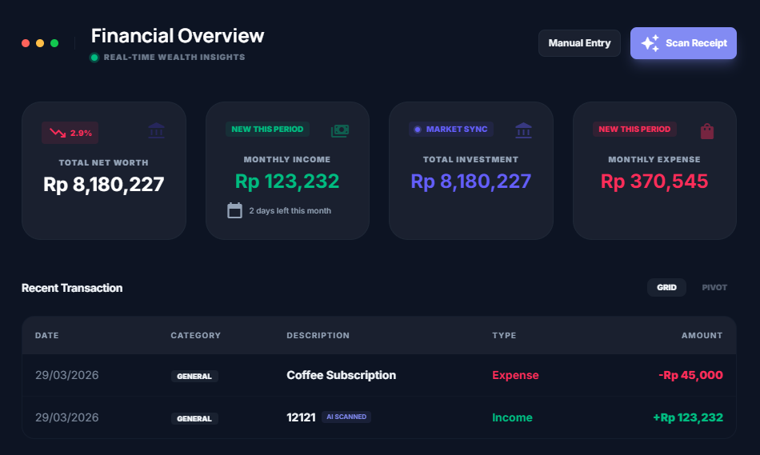

# SnapFins - Precision Finance Tracking & AI Wealth Management



SnapFins is a high-performance, premium personal finance application designed to give you absolute clarity over your wealth. Built with **Next.js 16**, **Tailwind CSS v4**, and **Supabase**, it combines modern aesthetics with powerful AI-driven insights to transform how you manage your money.

---

## Core Features

### Neural Vision Extraction (AI Scanner)
Powered by **Google Gemini 1.5/2.5 Flash**, our scanner doesn't just perform basic OCR. It interprets the **Spatial Intent** of your receipts, identifying merchant names, dates, and total amounts with 99.2% accuracy, even on complex or faded thermal paper.

### USD-Triangular Mathematical Pivot
To maintain sub-cent precision across multiple global currencies, the engine implements a triangular arbitrage model. Every asset valuation follows the normalization formula:
$$V = \sum (Q_i \times (P_i / P_{usd}))$$
By pinning all assets to a synthetic USD pivot, we eliminate "ghost volatility" from direct cross-pair conversions (e.g., IDR/SOL), ensuring your Net Worth delta is purely asset-driven.

### Immersive Analytics & Spreadsheet UI
Experience a high-performance data grid that handles thousands of rows with instant filtering and pivot views. Visualizations are powered by **Recharts**, providing real-time trend tracking and expense distribution.

### Global Localization & Theming
- **Dual-Language**: Full English & Indonesian support via a synchronized `i18n` dictionary.
- **Dynamic Theming**: Seamless Dark/Light mode transitions using `startViewTransition` and `localStorage` persistence.
- **Currency Engine**: Support for major global currencies (USD, IDR, etc.) with real-time market rate synchronization.

---

## Tech Stack

### Frontend
- **Framework**: [Next.js 16 (App Router)](https://nextjs.org/) - Utilizing React Server Components and optimized layouts.
- **Library**: [React 19](https://react.dev/) - Leveraging advanced hooks for state synchronization.
- **Styling**: [Tailwind CSS v4](https://tailwindcss.com/) - Modern, utility-first styling with high-performance CSS variables.
- **Animations**: [Framer Motion](https://www.framer.com/motion/) - For high-fidelity modal transitions and staggered entrance sequences.
- **Charts**: [Recharts](https://recharts.org/) - Lightweight and responsive SVG charts.

### Backend & Infrastructure
- **Database**: [Supabase](https://supabase.com/) - PostgreSQL with Row Level Security (RLS).
- **Authentication**: Supabase Auth (OAuth 2.0 with Google & GitHub).
- **AI Engine**: Google Generative AI (Gemini Flash) - Multimodal vision processing.
- **Deployment**: Vercel Edge Functions for low-latency market data syncing.

---

## Project Structure

```text
src/
├── app/            # Next.js App Router (Authenticated vs Public routes)
├── components/     # Atomic UI components & custom layouts
│   ├── layout/     # Persistent Header, Footer, and Navigation
│   └── modals/     # AI Scanner, Manual Entry, and Auth Modals
├── hooks/          # Custom React hooks (Theme, Lang, Currency, Reveal)
├── lib/            # Core Logic (i18n dictionary, Currency math, AI prompt)
├── utils/          # Supabase client, Formatters, & API helpers
└── types/          # Strict TypeScript interfaces for Ledger & Assets
```

---

## Data Sovereignty & Privacy
SnapFins operates on a **User-First Persistence** model. We use enterprise-grade encryption via Supabase RLS. We never sell your data, and Gemini AI outputs are processed securely. You own your data: you can purge your entire history at any time with a single click in your settings.

---

*Built for precision wealth management by [meryzennn](https://github.com/meryzennn)*
